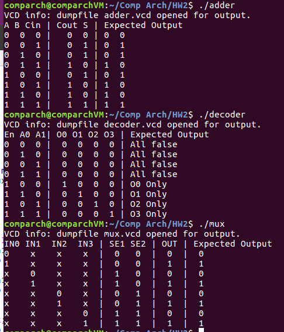
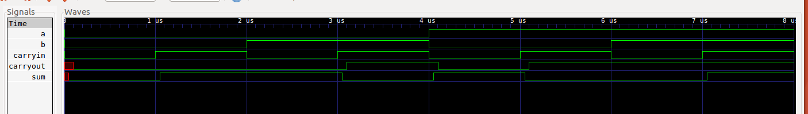
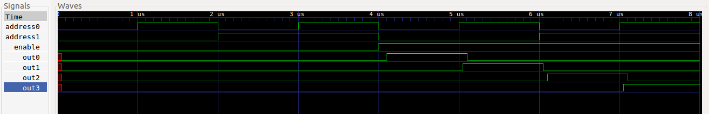
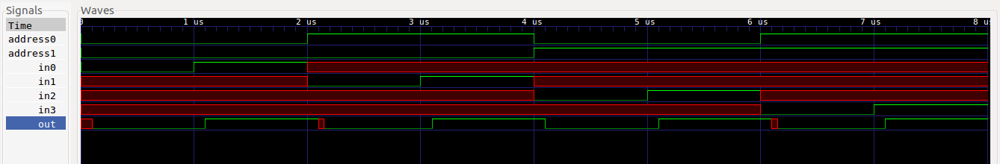

## TRUTH TABLES
Below are the truth tables generated by the structural devices, compared to what the truth tables should be.

Everything matches!

## GTKWAVE SIMULATIONS
GTKwave simulation for adder

GTKwave simulation for decoder

GTKwave simulation for multiplexer

